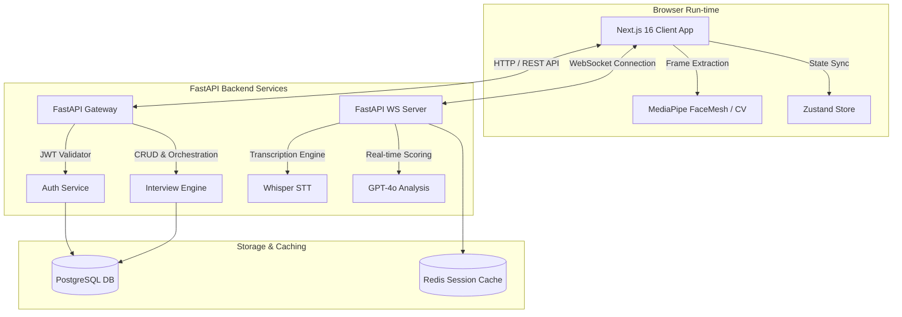

# 🚀 AI Interview Coach – Real-Time Feedback System

An elite, production-grade SaaS platform designed to revolutionize interview preparation. This system provides **real-time**, actionable feedback on speech patterns, content quality, and behavioral cues using state-of-the-art AI models, computer vision, and low-latency websocket pipelines.


---

## 🧠 Overview & Vision

The **AI Interview Coach** is a startup-grade, end-to-end SaaS platform built with high performance, scalability, and ultra-low latency. Rather than a simple mock interview page, this system provides interactive, live-streaming interview simulations where users receive **instant dynamic feedback**. 

The system operates across four intelligence dimensions:
1. **Speech Intelligence**: Measures speech velocity (WPM), voice hesitation (filler words like "um", "ah", "like"), volume fluctuations, and prosody using OpenAI's Whisper pipeline.
2. **Content Analysis**: Checks answering structure (e.g., alignment with the **STAR** method - Situation, Task, Action, Result), technical accuracy, relevancy, and vocabulary depth.
3. **Behavioral Tracking**: Analyzes posture, emotion fluctuations, and eye-contact consistency through browser-level computer vision processing.
4. **Confidence Indexing**: Aggregates vocal and visual indicators to construct a dynamic, real-time "Confidence Meter".

---

## 🏗️ System Architecture

### High-Level Design
The system uses a **decoupled Client-Server Architecture** optimized for handling real-time data flows without blocking the HTTP request-response cycle.



### Real-Time Streaming Pipeline
To achieve seamless interactive feedback, the communication pipeline is separated into two channels:
*   **WebRTC/WebSocket Audio Pipeline**: Audio streams are sent in chunks through a stateful WebSocket connection. Chunks are aggregated, processed via Whisper STT, and run through a lightweight evaluation buffer, maintaining a sub-`500ms` feedback latency.
*   **Edge-Based Video Pipeline**: To save server-side computing and eliminate expensive GPU host fees, video analysis is run **directly on the client** via Google MediaPipe. The computed metrics (eye contact vector, head position, emotion probability) are then periodically synced to the server.

---

## 🛠️ Tech Stack

| Domain | Technology | Rationale |
| :--- | :--- | :--- |
| **Frontend Framework** | **Next.js 16 (React 19)** | App Router architecture for optimized route handling, code splitting, and responsive views. |
| **State Management** | **Zustand** | Lightweight, high-performance global state synchronization without React context re-render overhead. |
| **Animation Engine** | **Framer Motion** | Silky-smooth micro-animations, slide transitions, and dynamic loading feedback. |
| **Computer Vision** | **MediaPipe FaceMesh** | Efficient client-side visual telemetry (tracking eye contact, gaze vectors, and facial landmarks). |
| **Backend API** | **FastAPI** | Asynchronous Python framework with native ASGI capabilities, ideal for handling WebSockets and high-throughput workloads. |
| **Database ORM** | **SQLAlchemy + Asyncpg** | Fully asynchronous PostgreSQL connection pool to prevent database blocking during concurrent operations. |
| **Caching & Broker** | **Redis** | In-memory key-value store for session states, active socket mappings, and rate-limiting counters. |
| **AI Evaluation** | **GPT-4o & Whisper** | Industry-standard language reasoning, precise speech-to-text transcriptions, and qualitative content grading. |
| **Containerization** | **Docker / Compose** | Standardizes infrastructure dependencies (PostgreSQL, Redis, Python environment, Node packages) for local and cloud deploys. |

---

## 📁 Repository Structure

```
ai-interview-coach/
├── backend/
│   ├── app/
│   │   ├── api/             # API Router, endpoints (auth, interviews, analytics, billing)
│   │   ├── ai/              # AI prompt templates, LLM wrappers, Whisper interfaces
│   │   ├── middleware/      # CORS, rate limiting, and global error logs
│   │   ├── models/          # SQLAlchemy async data schemas
│   │   ├── schemas/         # Pydantic request/response validation schemas
│   │   ├── services/        # Business logic controllers (Billing, User, Session, Stripe)
│   │   ├── config.py        # Environment settings (pydantic-settings)
│   │   ├── database.py      # Async database engines and session lifecycles
│   │   └── main.py          # FastAPI application initialization
│   ├── Dockerfile           # Backend container build specification
│   ├── requirements.txt     # Python production-level requirements
│   └── .env.example         # System environment configurations
├── frontend/
│   ├── src/
│   │   ├── app/             # Next.js App Router (dashboard, login, interview pages)
│   │   ├── services/        # Axios API client (api.ts) with JWT interceptors
│   │   └── store/           # Zustand global state (user context, active session variables)
│   ├── public/              # Static media files, logos, and layouts
│   ├── Dockerfile           # Frontend production-build environment
│   ├── package.json         # Node scripts & dependencies (React 19, Next 16)
│   └── tsconfig.json        # TypeScript configuration settings
├── docker-compose.yml       # Multi-container local execution mapping
└── README.md                # General system documentation
```

---

## 🚀 Getting Started

### 1. Prerequisites
Ensure you have the following installed:
*   [Docker Desktop](https://www.docker.com/products/docker-desktop/)
*   [Node.js v20+](https://nodejs.org/) (for local frontend dev)
*   [Python 3.11+](https://www.python.org/) (for local backend dev)
*   An active [OpenAI API Key](https://platform.openai.com/)

---

### 2. Quick Start with Docker (Recommended)

The easiest way to spin up the complete infrastructure—including the FastAPI backend, Next.js frontend, PostgreSQL database, and Redis caching server—is via Docker Compose.

1.  **Clone the Repository**:
    ```bash
    git clone https://github.com/your-username/ai-interview-coach.git
    cd ai-interview-coach
    ```

2.  **Configure Environment Variables**:
    Create a root `.env` file or write variables directly in `./backend/.env`:
    ```bash
    cp backend/.env.example backend/.env
    ```
    Open the newly created `.env` file and insert your OpenAI & Stripe API keys:
    ```env
    OPENAI_API_KEY=sk-proj-yourActualOpenAiKeyHere...
    STRIPE_SECRET_KEY=sk_test_yourStripeKeyHere...
    ```

3.  **Boot Up the Infrastructure**:
    ```bash
    docker-compose up --build
    ```

4.  **Access the Application Ports**:
    *   **Frontend User Portal**: `http://localhost:3000`
    *   **Interactive Swagger Documentation**: `http://localhost:8000/api/v1/docs`
    *   **PostgreSQL Instance**: `localhost:5432` (User/Password: `postgres`/`postgres`)
    *   **Redis CLI Port**: `localhost:6379`

---

### 3. Local Development (Alternative Setup)

If you prefer to run the components natively without Docker containers:

#### Backend Setup:
```bash
cd backend

# Create and activate Python virtual environment
python -m venv venv
# On Windows:
.\venv\Scripts\activate
# On macOS/Linux:
source venv/bin/activate

# Install application dependencies
pip install -r requirements.txt

# Run migrations or setup initial DB schema (SQLite file interview_coach.db is used if POSTGRES is unavailable)
# Start the FastAPI application on local port 8000
python -m uvicorn app.main:app --reload
```

#### Frontend Setup:
```bash
cd frontend

# Install package dependencies
npm install

# Run the development server
npm run dev
```
Open `http://localhost:3000` in your browser. The frontend will point to the backend server running on `http://localhost:8000`.

---

## 🔌 API Routes Specification

The application features full Swagger UI and Redoc interactive API visualizers. Below is a breakdown of the primary operational endpoints:

### 🔐 Authentication (`/api/v1/auth`)
*   `POST /auth/register` - Registers a new user. Expects a username, email, and password.
*   `POST /auth/login` - Validates credentials. Returns an OAuth2-compliant JWT token.
*   `GET /auth/me` - Resolves the current session user info from the JWT authorization headers.

### 🎤 Interview Engine (`/api/v1/interviews`)
*   `GET /interviews` - Retrieves user interview history and metrics.
*   `POST /interviews/start` - Prepares a session. Returns structural metadata and first adaptive question.
*   `POST /interviews/{session_id}/answer` - Submits final answers and triggers background asynchronous evaluation.
*   `GET /interviews/{session_id}/results` - Provides granular scoring, feedback, transcripts, and computer vision logs.

### 📊 Analytics Engine (`/api/v1/analytics`)
*   `GET /analytics/dashboard` - Fetches global aggregated metrics (average scores, WPM variance, confidence trends).
*   `GET /analytics/weaknesses` - Isolates recurring grammatical, cognitive, or behavioral points of improvement.

### 💳 Stripe Billing & Subscriptions (`/api/v1/billing`)
*   `POST /billing/subscribe` - Generates a Stripe Checkout Session for upgrading to Pro tier.
*   `POST /billing/webhook` - Handles webhooks from Stripe (updates account role status on successful payments/cancellations).

---

## 🛡️ Security, Rate-Limiting & Caching

*   **Role-Based Access Control (RBAC)**: REST endpoints check user status (`Free` vs `Pro`). Free users are restricted to standard analytics and 3 mock sessions per month.
*   **IP-Based Rate Limiting**: Intercepts connections to endpoints like login and AI scoring using a sliding-window Redis counter.
*   **Encrypted Secrets**: Custom middleware automatically sanitizes and handles API keys, validation schemas, and database transactions safely.

---

## 📈 Performance & Scaling Roadmap (1M+ Active Users)

```
[Phase 1: MVP] ───────► [Phase 2: Growth] ───────► [Phase 3: High Scale]
Single node deployment  Kubernetes orchestration  Self-hosted local GPU clusters
OpenAI API processing   Celery task queues        Distributed multi-region DB replicas
Local PostgreSQL        Redis cluster caching     CDN Edge-caching for assets
```

1.  **Phase 1 (Active)**: Lightweight monolith, client-side MediaPipe computation, OpenAI GPT API for low overhead and quick evaluation cycles.
2.  **Phase 2 (Target)**: Decoupling the video analysis sync and transcripts to run in background worker processes (via **Celery** or **ARQ** with Redis as a broker). Setting up DB clustering with horizontal read-replicas.
3.  **Phase 3 (Scale)**: Deploying local open-source inference models (Whisper-large & Llama-3-70B-Instruct) on dedicated GPU servers (AWS EC2 G5 / RunPod instances) to slash OpenAI usage costs by over 90%.

---

## 📜 License

This project is licensed under the MIT License - see the [LICENSE](LICENSE) file for details.

---

## 👤 Credits & Support

Developed by **Staff AI Engineer & SaaS Architect**. For pull requests, questions, or issues, please submit an issue on the repository page.
